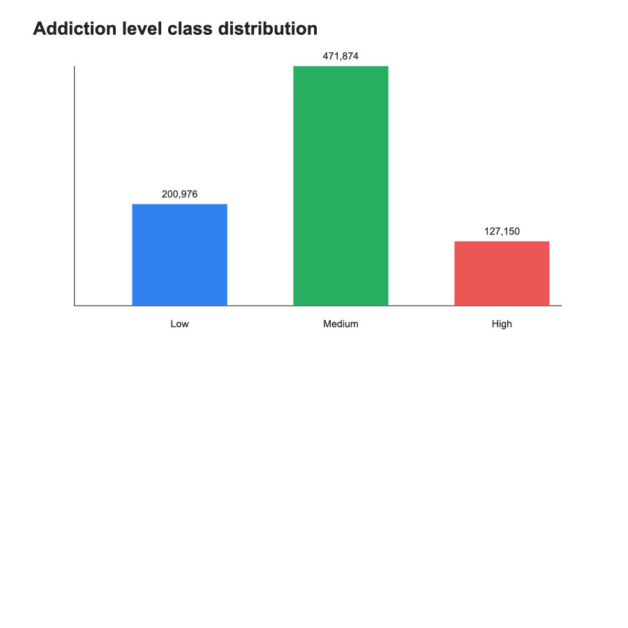
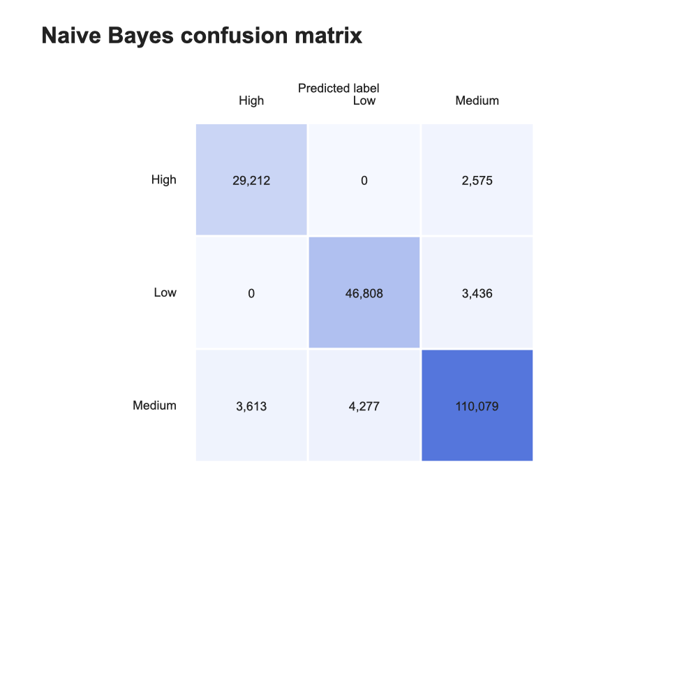
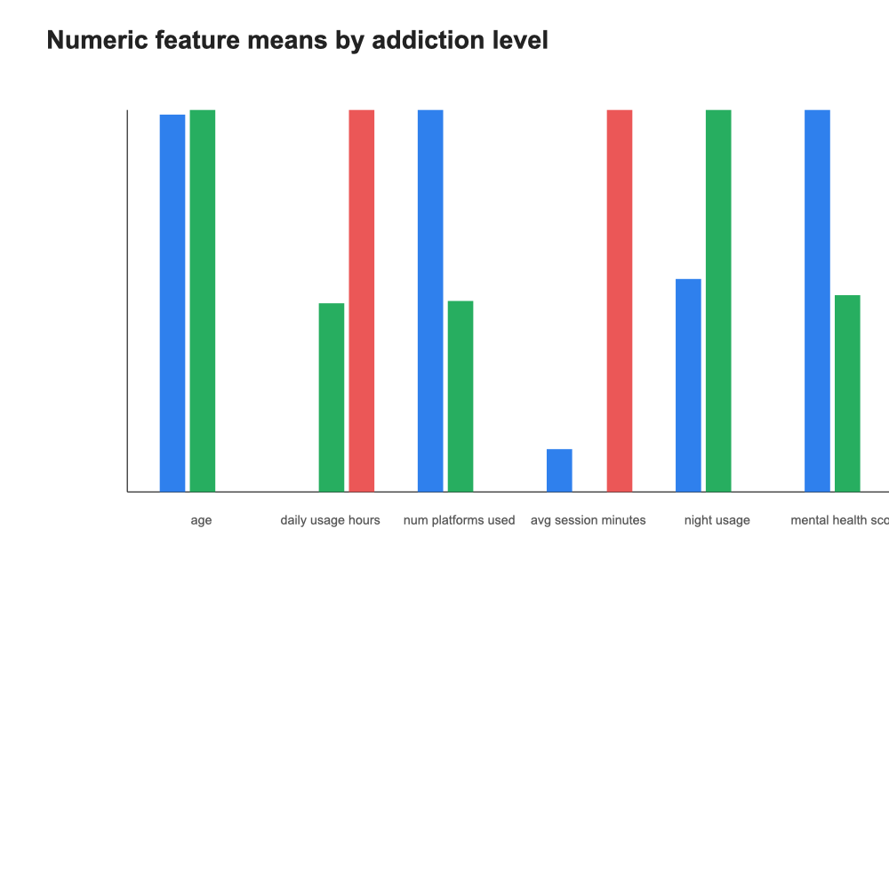

## Агуулга

- Судалгааны асуудал
- Өгөгдлийн бүтэц
- Өгөгдөл бэлтгэл
- Naive Bayes арга зүй
- Загварын хэрэгжүүлэлт
- Үр дүн ба confusion matrix
- Дүгнэлт

## Судалгааны асуудал

Social media хэрэглээний хэв маяг хэрэглэгч бүр дээр ялгаатай.

Энэ төслийн үндсэн асуулт:

> Social media хэрэглээний өгөгдлөөр хэрэглэгчийн донтолтын түвшинг `Low`, `Medium`, `High` гэж автоматаар ангилж болох уу?

## Төслийн зорилго

Gen Z хэрэглэгчдийн social media хэрэглээний өгөгдлийг ашиглан `addiction_level` буюу донтолтын түвшинг Naive Bayes алгоритмаар ангилах.

Зорилтууд:

- Өгөгдлийг машин сургалтад бэлтгэх
- Naive Bayes загварыг Python дээр хэрэгжүүлэх
- Тоон болон категори хувьсагчийг хамтад нь ашиглах
- Загварын үр дүнг үнэлэх, дүрслэх

## Өгөгдөл

Ашигласан файл:

```text
genz_social_media_usage_1M.csv
```

Үндсэн мэдээлэл:

- Нийт мөр: **1,000,000**
- Train өгөгдөл: **800,000**
- Dev өгөгдөл: **200,000**
- Target: `addiction_level`

## Target ангилал

`addiction_level` багана нь гурван ангилалтай.

| Ангилал | Утга |
|---|---|
| `Low` | Бага түвшин |
| `Medium` | Дунд түвшин |
| `High` | Өндөр түвшин |

## Feature-үүд

Тоон хувьсагчид:

- `age`
- `daily_usage_hours`
- `num_platforms_used`
- `avg_session_minutes`
- `night_usage`
- `mental_health_score`
- `screen_time_before_sleep`

Категори хувьсагчид:

- `gender`
- `country`
- `primary_platform`
- `purpose`

## Өгөгдөл бэлтгэл

Хийсэн алхмууд:

1. CSV өгөгдөл унших
2. Шаардлагатай багануудыг шалгах
3. Missing value шалгах
4. Тоон багануудыг numeric төрөлд хөрвүүлэх
5. Категори багануудыг цэвэрлэх
6. Давхардсан мөр шалгах
7. Train/dev split хийх

## Өгөгдлийн цэвэрлэгээний үр дүн

| Үзүүлэлт | Утга |
|---|---:|
| Анхны мөрийн тоо | 1,000,000 |
| Цэвэрлэгээний дараах мөр | 1,000,000 |
| Давхардал арилгасны дараах мөр | 1,000,000 |
| Устгасан давхардал | 0 |

Өгөгдөлд missing value илрээгүй.

## Ангиллын тархалт

{fig-alt="Addiction level class distribution" width="78%"}

`Medium` ангилал хамгийн олон тул үнэлгээнд зөвхөн accuracy ашиглах нь хангалтгүй.

## Арга зүй: Naive Bayes

Naive Bayes нь Байесын теоремд тулгуурласан статистик ангиллын арга.

$$
P(C\mid X)=\frac{P(X\mid C)P(C)}{P(X)}
$$

Энд:

- $C$ нь ангилал
- $X$ нь хэрэглэгчийн feature-үүд
- $P(C\mid X)$ нь тухайн ангилалд хамаарах магадлал

## Хараат бусын таамаглал

Naive Bayes дараах хялбаршуулсан таамаглал ашигладаг.

$$
P(X_1,X_2,\dots,X_n\mid C)
=
\prod_{i=1}^{n} P(X_i\mid C)
$$

Өөрөөр хэлбэл feature-үүдийг тухайн ангилал өгөгдсөн үед хоорондоо хараат бус гэж үзнэ.

## Тоон хувьсагчид

Тоон хувьсагчдад Gaussian Naive Bayes ашигласан.

$$
P(x_i\mid C)
=
\frac{1}{\sqrt{2\pi\sigma_C^2}}
\exp
\left(
-
\frac{(x_i-\mu_C)^2}{2\sigma_C^2}
\right)
$$

Загвар class бүр дээр:

- дундаж утга
- дисперс

тооцно.

## Категори хувьсагчид

Категори хувьсагчдад Laplace smoothing ашигласан.

$$
P(x_i=v\mid C)
=
\frac{count(v,C)+\alpha}{N_C+\alpha(K+1)}
$$

Давуу тал:

- Шинэ category таарахад магадлал 0 болохгүй
- Загвар илүү тогтвортой болно

## Log probability

Олон жижиг магадлалыг шууд үржүүлэхэд тоон underflow үүсэж болно.

Тиймээс log probability ашигласан.

$$
\log P(C\mid X)
\propto
\log P(C)
+
\sum_i \log P(X_i\mid C)
$$

Шийдвэр:

$$
\hat{C} = \arg\max_C \log P(C\mid X)
$$

## Project-ийн бүтэц

```text
src/
├── config.py
├── dataset.py
├── naive_bayes.py
├── metrics.py
├── visualization.py
└── main.py
```

## Кодын үүрэг

| Файл | Үүрэг |
|---|---|
| `dataset.py` | Өгөгдөл унших, цэвэрлэх, split хийх |
| `naive_bayes.py` | Naive Bayes алгоритм |
| `metrics.py` | Accuracy, F1, confusion matrix |
| `visualization.py` | График үүсгэх |
| `main.py` | Бүх pipeline-г ажиллуулах |

## Ажиллуулах команд

```bash
python3 -m venv .venv
source .venv/bin/activate
python3 -m pip install -r requirements.txt
python3 main.py
```

Хүлээгдэх үндсэн гаралт:

```text
Accuracy: 93.05%
Macro F1: 92.29%
```

## Үр дүн

| Үзүүлэлт | Утга |
|---|---:|
| Accuracy | **93.05%** |
| Macro F1-score | **92.29%** |
| Train rows | 800,000 |
| Dev rows | 200,000 |

Macro F1-score ашигласнаар ангилал тус бүрийн чанарыг илүү тэнцвэртэй харсан.

## Ангилал тус бүрийн үр дүн

| Ангилал | Precision | Recall | F1-score |
|---|---:|---:|---:|
| High | 88.99% | 91.90% | 90.42% |
| Low | 91.63% | 93.16% | 92.39% |
| Medium | 94.82% | 93.31% | 94.06% |

## Confusion matrix

{fig-alt="Naive Bayes confusion matrix" width="72%"}

## Confusion matrix тайлбар

Гол ажиглалтууд:

- `Medium` ангилал хамгийн олон зөв таамаглагдсан
- `Low` болон `High` шууд их андуурагдаагүй
- Алдаа голчлон `Medium` ангилалтай зааг дээр гарсан
- Энэ нь дунд түвшний хэрэглээ өндөр/бага түвшинтэй зарим шинжээр ойролцоо байж болохыг харуулна

## Тоон feature-ийн ялгаа

{fig-alt="Numeric feature means by addiction level" width="86%"}

## Үр дүнгийн утга

Загвар сайн ажилласан шалтгаан:

- Өгөгдлийн хэмжээ их
- Тоон feature-үүд target ангилалтай ялгарах мэдээлэл агуулсан
- Категори feature-үүд хэрэглээний хэв маягийг нэмэлтээр тайлбарласан
- Naive Bayes том өгөгдөл дээр хурдан сурсан

## Давуу тал

Naive Bayes загварын давуу тал:

- Хэрэгжүүлэхэд энгийн
- Тооцоолол хурдан
- Том өгөгдөл дээр хөнгөн
- Магадлалын тайлбартай
- Ангилал тус бүрийн параметрийг харах боломжтой

## Хязгаарлалт

Энэхүү загвар дараах хязгаарлалттай:

- Feature-үүдийг хараат бус гэж үздэг
- Тоон feature-үүдийг Gaussian тархалттай гэж ойролцоолдог
- `addiction_level` нь өгөгдлийн label болохоос эмнэлзүйн онош биш
- Өгөгдлийн эх сурвалж, label үүссэн арга тодорхой байх тусам дүгнэлт илүү найдвартай болно

## Ёс зүйн анхаарах зүйл

Энэ загварыг:

- Хүнийг оношлох
- Шошголох
- Ялгаварлах
- Бодит сэтгэлзүйн үнэлгээ орлуулах

зорилгоор ашиглах ёсгүй.

Энэ нь сургалт, судалгааны зориулалттай машин сургалтын загвар юм.

## Дүгнэлт

Судалгааны хүрээнд:

- 1,000,000 мөр өгөгдлийг боловсруулсан
- Naive Bayes алгоритмыг Python дээр хэрэгжүүлсэн
- Тоон болон категори feature-ийг хамтад нь ашигласан
- Dev өгөгдөл дээр accuracy **93.05%** гарсан
- Macro F1-score **92.29%** гарсан

## Ерөнхий дүгнэлт

Naive Bayes алгоритм нь social media хэрэглээний өгөгдөл дээр донтолтын түвшинг ангилахад тохиромжтой, хурдан, тайлбарлагдах боломжтой статистик арга болохыг туршилтын үр дүн харууллаа.

## Багийн гишүүд

| Гишүүн | Үүрэг |
|---|---|
| Нэр 1 | Сэдэв, өгөгдлийн тайлбар |
| Нэр 2 | Өгөгдөл бэлтгэл |
| Нэр 3 | Naive Bayes алгоритм |
| Нэр 4 | Үнэлгээ, visualization |
| Нэр 5 | Тайлан, presentation |

## Ашигласан материал

- Russell, S., & Norvig, P. (2021). *Artificial intelligence: A modern approach*.
- Python Software Foundation. *Python documentation*.
- Scikit-learn Developers. *Naive Bayes*.
- Kaggle. *Datasets*.

## Анхаарал тавьсанд баярлалаа

Асуулт байна уу?
